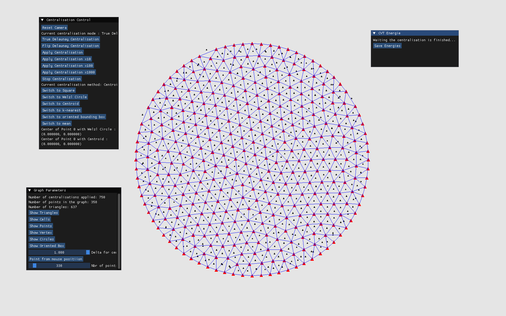

# CellsCenter - CVT energie optimisation

## Introduction

This repository is a research project. It is a software tool designed to visualize and test different types of graph optimization using CVT energy.  
It was created to optimize the positioning of various points while maintaining a Delaunay structure.



## 1 - How to build

This project uses OpenGL with some external libraries such as Eigen and ImGui, which are included in the repository (or fetched for Eigen).

It compiles for Windows with MSVC Visual Studio 2022 or macOS Clang 15.0.0. You will need CMake and Ninja installed.

```
mkdir build
cd build
cmake ..
make
```

## 2 - How to use it

You can move the camera with Space (Up), Shift (Down), A (Left), D (Right), and use W/S to zoom in/out.

### Centralisation Control


Here you can choose which type of centralisation and which Delaunay "checking" (centralisation mode) you want to use.

The "Apply Centralisation" button lets you specify how many frames (steps) you want to apply the centralisation for.

What happens at each step? It depends on the centralisation mode you have chosen:


- **Delaunay "checking" (centralisation mode):**

True Delaunay Centralisation computes a Delaunay Triangulation at each iteration, which is time-consuming. To optimize this, we implemented a flipping method: Flip Delaunay Centralisation (designed to be used in parallel with the GPU).

- **Centralisation method:**

This determines how you want to centralise your points. Initially, we apply Delaunay and compute the Voronoi vertices. For each point, we have a set of neighboring Voronoi vertices. Each button represents a different way to centralise the point using these neighbors.

You have:
- **Square:** The Bounding Box (BB) of all these vertices along the X and Y axes of the screen.
- **Oriented Bounding Box:** Similar to Square, but the BB angle is set using SVD with Eigen.
- **Welzl Circle:** Like the BB, but we search for the minimal circumcircle using the Welzl Algorithm, which is supposed to have O(n) complexity.
- **Centroid:** The original way to optimize the CVT energy. We compute the centroid of the polygon formed by the set of neighbors.
- **K-nearest:** Not a very efficient or developed method here. It's like Centroid but with fewer selected points.
- **Mean:** We take the mean of this set of points and set the new location to it.

You can see the efficiency of these methods in this spreadsheet:  
https://docs.google.com/spreadsheets/d/18MPvDYlGASeUxNnMwO2m1nbUb-FsB5BJpj7MAQMBvg0/edit?usp=sharing

Here is a screenshot:  


### Display Parameters


You can display various parameters, but some are only available with specific centralisation methods.

You have:
- **Triangles:** Show the Delaunay triangulation.
- **Cells:** Show the Voronoi cells.
- **Points:** Show the original point graph.
- **Vertex:** Show the Voronoi vertices.
- **Circle:** Show the circumcircle of each triangle.
- **Oriented Box:** Show all bounding boxes (only usable with the Square and OBB methods).

Next, you have the Delta Centralisation parameter. This controls a linear interpolation between the new position computed by centralisation and the previous one. You can choose to apply full centralisation (=1) or disable it (=0).

The "Point from mouse position" button lets you interact with the graph. It sets a point at your mouse position (if you are in the default camera view).

The last slider controls the number of points to generate randomly. Each time you change this number, the graph is regenerated.

### CVT Energy


The first button allows you to select a random point and view its current CVT energy.

The last button lets you export a `.csv` file containing the history of the total CVT energy for each iteration. To use this feature, you need to change the save path in `imguiRender.cpp` (see the call to the `save_energies_to_csv()` function).


